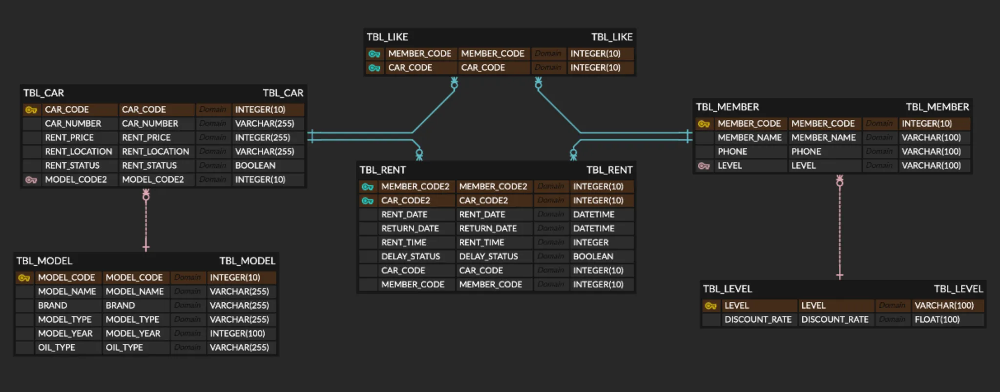

# 🚗 자동차 대여 서비스 (RentCar Service)

## 📌 프로젝트 소개
본 프로젝트는 Spring boot 기반의 자동차 대여 시스템으로, **회원 관리**, **차량 관리**, **대여 이력 관리** 등의 기능을 제공합니다.

## 🛠️ 기술 스택
- Spring boot
- MySQL
- MyBatis
- Thymeleaf

## 🤝 협업 도구
- GitHub
- Notion

## 🗂️ 디렉토리 구조

```
spring-rentcar-crud-project
├── java
│   └── main
│       └── com
│           └── c1z4
│               └── rentcar
│                   ├── car
│                   ├── config
│                   ├── like
│                   │   ├── controller
│                   │   └── model
│                   │       ├── dao
│                   │       ├── dto
│                   │       └── service
│                   ├── main
│                   ├── member
│                   │   ├── controller
│                   │   └── model
│                   │       ├── dao
│                   │       ├── dto
│                   │       └── service
│                   └── rent
│                       ├── controller
│                       └── model
│                           ├── dao
│                           ├── dto
│                           └── service
│
└── resources
    └── main
        ├── mappers
        │   └── rent
        ├── static
        │   └── css
        └── templates
            ├── car
            ├── common
            ├── like
            ├── member
            └── rent
	              └── history

```


## [🗃️ 데이터베이스 모델링](http://erdcloud.com/d/WeLzxu2E3JyEFLTve)


### 🔗 테이블 관계 설명
- `TBL_MEMBER (회원)` ↔ `TBL_LEVEL (등급)`: 1:N 관계  
  (한 등급을 여러 회원이 가질 수 있음)
- `TBL_MEMBER` ↔ `TBL_RENT` ↔ `TBL_CAR`: 대여 내역을 통한 다대다 관계
- `TBL_MEMBER` ↔ `TBL_LIKE`: 회원이 찜한 차량 정보 저장
- `TBL_CAR` ↔ `TBL_MODEL`: 차량 모델 정보 연동

### 📋 주요 테이블 설명
- `TBL_MEMBER`: 회원 정보 (이름, 연락처, 등급 등)
- `TBL_CAR`: 차량 정보 (차량번호, 대여료, 위치, 상태 등)
- `TBL_RENT`: 대여 내역 (대여일, 반납일, 연체 여부 등)
- `TBL_LIKE`: 회원이 찜한 차량 정보
- `TBL_LEVEL`: 회원 등급 및 할인율
- `TBL_MODEL`: 차량 모델 및 사양 정보

## ✨ 주요 기능

### 회원 관리
- 회원 검색
- 회원 전체 조회
- 회원 등록
- 회원 정보 수정
- 회원 삭제

### 좋아요 관리
- 회원별 좋아요 리스트 출력
- 출력된 리스트에서 차량 좋아요 또는 좋아요 취소

### 차량 관리
- 차량 전체 조회
- 차량 등록
- 차량 정보 수정
- 차량 삭제

### 대여 관리
- 차량 대여
- 차량 반납
- 회원별/차량별 대여 이력 조회


## ✅ C1Z4 정보
- PM : 김시은
- CM : 이지은
- DBA : 류지원, 안지명
- Document Manager : 황지희

## ☑️ 기타
- [코드 컨벤션 & git 컨벤션](https://www.notion.so/ohgiraffers/Git-203649136c118005a786f679f48439f9)
